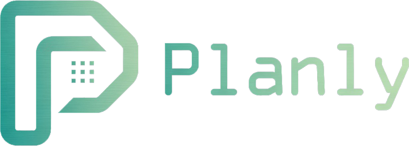
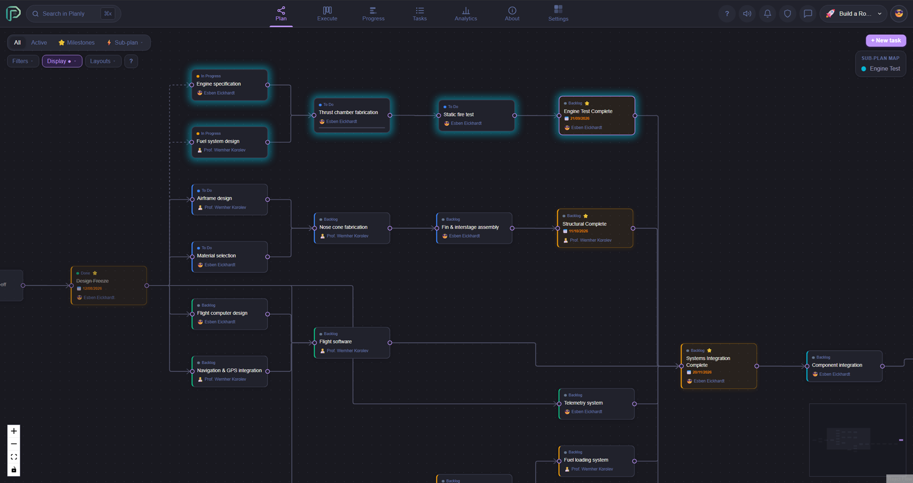
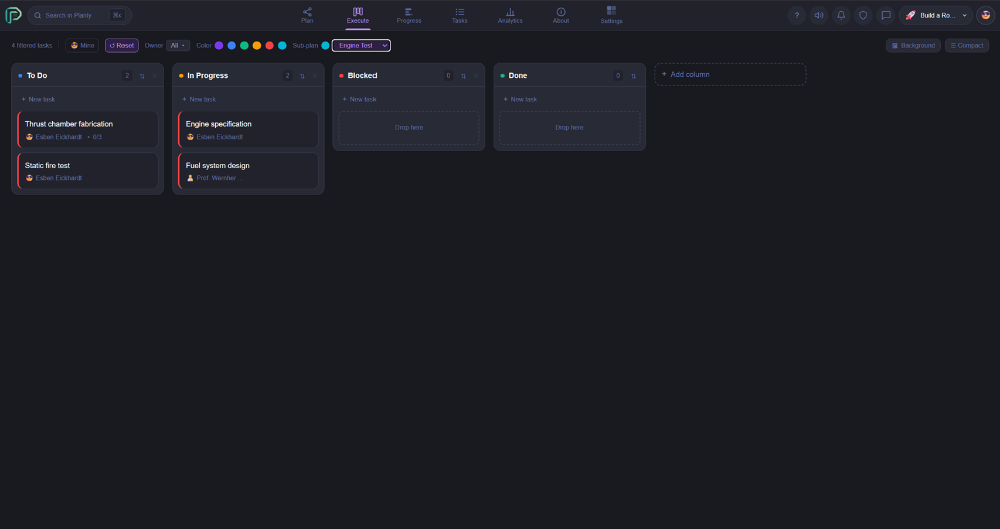
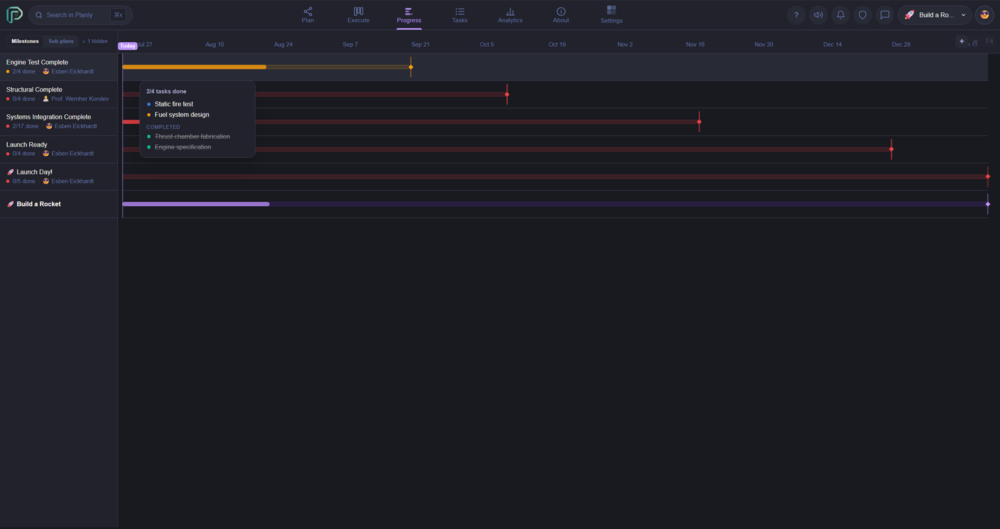
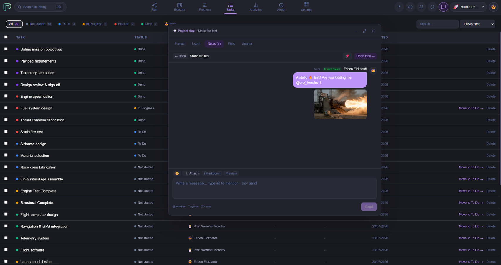

<p align="center">
  
</p>

<p align="center">
  Self-hosted project management - Canvas, Kanban, Gantt, and per-task chat in one Docker command.
</p>

<p align="center">
  <a href="#quick-start">Quick Start</a> · <a href="docs/wiki/Getting-Started.md">Setup Guide</a> · <a href="docs/wiki/Home.md">Wiki</a> · <a href="docs/wiki/API-Reference.md">API Reference</a>
</p>

<div align="center">
<table>
<tr>
  <td align="center"><br/><sub>Canvas</sub></td>
  <td align="center"><br/><sub>Kanban</sub></td>
</tr>
<tr>
  <td align="center"><br/><sub>Gantt</sub></td>
  <td align="center"><br/><sub>Chat</sub></td>
</tr>
</table>
</div>

## Quick Start

**Requirements:** Docker and Docker Compose v2.

```bash
git clone https://github.com/EsbenEickhardt/planly.git
cd planly
cp .env.example .env
# Edit .env - set DB_PASSWORD, JWT_SECRET, ENCRYPTION_KEY, ADMIN_EMAIL
# Generate secrets with: openssl rand -hex 32
docker compose up --build
```

Open [http://localhost](http://localhost) and register with your `ADMIN_EMAIL` to become the founding admin.

If you didn't set `ADMIN_PASSWORD`, a random password is printed to the backend logs on first start:

```bash
docker compose logs backend | grep "Password:"
```

For HTTPS + automatic TLS: [Deployment guide](docs/wiki/Deployment.md).

## Philosophy

Planly is built around a few strong opinions:

- **Plan visually**: Tasks and their dependencies are created and mapped in the canvas. This provides an overview of which tasks need to be completed to reach milestones, and which tasks can be worked on in parallel. All tasks and milestones are directed towards a final goal.
- **No time tracking**: Time spent is not a proxy for value delivered. Planly tracks what matters: what needs doing, who owns it, and when it's due.
- **Everything has an owner**: If a task is everyone's responsibility, it is noones responsibility. Therefore every task is assigned to an owber. Ownership removes ambiguity and makes accountability visible without surveillance.
- **Your data, your server**: No cloud middleman, no vendor lock-in, no surprise pricing. One `docker compose up` and you're running it yourself.
- **Automation should be easy**: With webhooks, app registrations, personal access tokens at your hand, you can you can integrate to other systems and automate time-wasting tasks.

## Features

- **Views** - Plan (canvas), Execute (kanban), Progress (gantt), Tasks (full task list)
- **Collaboration** - real-time WebSocket updates, per-task comment threads with `@mentions`, project chat with file attachments
- **Access control** - role-based team permissions, tab-level overrides, invite links, access request workflow
- **Security** - TOTP 2FA, SSO/OIDC (Google, Entra, Okta, Keycloak, any OIDC provider), IP allowlists, progressive account lockout, audit log
- **API** - REST API, Personal Access Tokens, App Registrations, webhooks (HMAC-signed), iCal export

## Documentation

| | |
|---|---|
| [Getting Started](docs/wiki/Getting-Started.md) | Install, first login, invite your team |
| [Configuration](docs/wiki/Configuration.md) | Env vars, SMTP, SSO/OIDC |
| [Deployment](docs/wiki/Deployment.md) | Dev vs production, upgrades, backups |
| [User Guide](docs/wiki/User-Guide.md) | Views, tasks, search, calendar export |
| [API Reference](docs/wiki/API-Reference.md) | REST endpoints with examples |
| [Webhooks](docs/wiki/Webhooks.md) | Event catalog, payloads, signature verification |
| [Access Tokens](docs/wiki/Access-Tokens.md) | PATs and App Registrations |
| [Security](docs/wiki/Security.md) | Auth model, MFA, CSRF, IP restrictions |
| [Administration](docs/wiki/Administration.md) | Admin panel, audit logs, user management |
| [Development](docs/wiki/Development.md) | Local dev setup, architecture |

## Tech Stack

Fastify 5 + TypeScript · Prisma 5 · PostgreSQL 16 · React 18 + TailwindCSS · WebSocket · Docker Compose (dev) / Traefik + Let's Encrypt (prod)

## License

Source-available under the [Planly Community License v1.0](LICENSE). Use it, run it, study it, contribute to it - freely. You may not sell it, fork it into a competing product, or use the code to train AI models.
